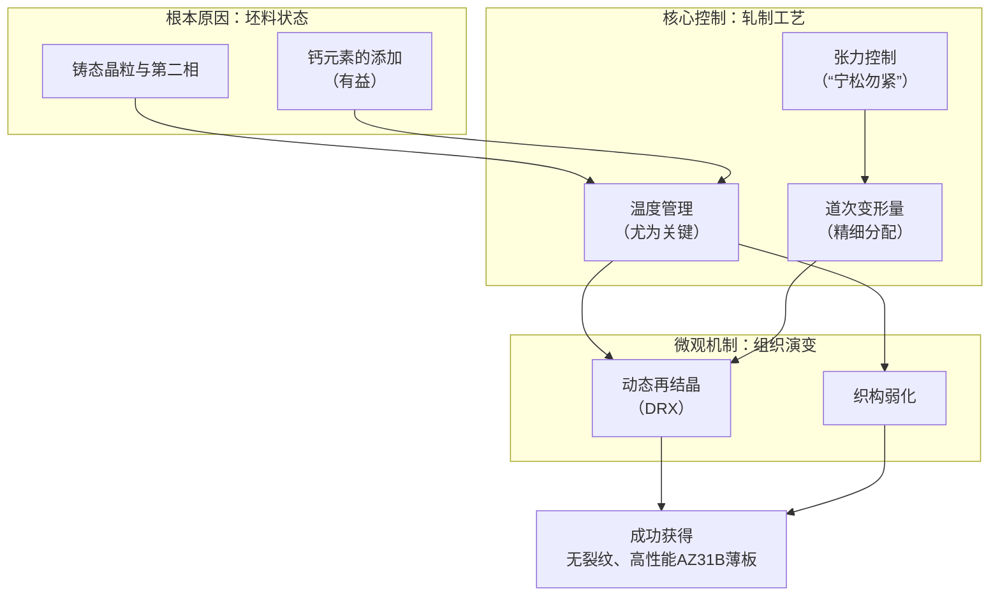

```mermaid
flowchart TD
    subgraph A [根本原因：坯料状态]
        A1[铸态晶粒与第二相]
        A2[钙元素的添加<br>（有益）]
    end

    subgraph B [核心控制：轧制工艺]
        B1[温度管理<br>（尤为关键）]
        B2[道次变形量<br>（精细分配）]
        B3["张力控制<br>（“宁松勿紧”）"]
    end

    subgraph C [微观机制：组织演变]
        C1[动态再结晶<br>（DRX）]
        C2[织构弱化]
    end

    A1 & A2 --> B1
    B1 --> C1 & C2
    B2 --> C1
    B3 --> B2
    C1 & C2 --> D[成功获得<br>无裂纹、高性能AZ31B薄板]
```
