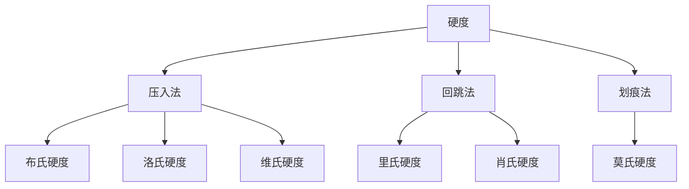

# 1. 引言 

# 2. 硬度 

## 2.1 基础知识 
> [!note] 硬度
> - 表征材料抵抗变形或破坏的能力，是热处理行业最常用的指标之一。是一个力学性能的综合性指标，一般来说，材料的硬度越高，抗拉强度越高，耐磨性越好
> - 显微硬度、布氏硬度、洛氏硬度[^1]

1. 硬度知识点[^3]
2. 硬度分类[^5]
## 2.2 经验技巧 
3. 硬度和强度换算表[^2]
4. 金属硬度测试方法大汇总（附硬度换算表）[^4]
# REF 

[^1]: [硬度那些事~](https://mp.weixin.qq.com/s/LQYdIHytEyFyUEOzXE49_g)
[^2]: [黑色金属硬度和强度换算表](https://mp.weixin.qq.com/s/LL0JT6U5lmSDLls_4bhOVA)
	[黑色金属硬度和强度换算表（2）](https://mp.weixin.qq.com/s/g_kwqRdWh7KJa-eB7NIFow)
[^3]: [硬度那些事~](https://mp.weixin.qq.com/s/fWxroVqWB3PwgDCbHcepoQ)
[^4]: [金属硬度测试方法大汇总（附硬度换算表）](https://mp.weixin.qq.com/s/P-ogMfnbfaXiiQw7tgxt3w)

[^5]: [【硬度】2B铅笔中的2B是啥意思？](https://mp.weixin.qq.com/s/UAC6WcDUORpB7atSqnwgaA)
