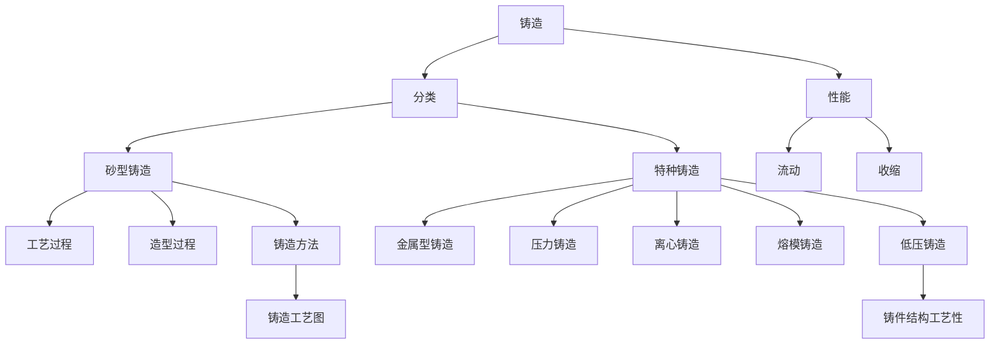

# 1. 引言 

# 2. 铸造凝固
## 2.1 基础理论 

## 2.2 铸造类别 

## 2.3 问题措施 
1. 压铸件发黑及预防办法[^1]
2. 铸件产生热裂的原因及预防措施[^2]

## 2.4 铸造工艺设计 

# Ref 

[^1]: [压铸件发黑原因及预防措施](https://mp.weixin.qq.com/s/YJAUdv__e_JOFKIh-iScVw)

[^2]: [【知识】铸件产生热裂的原因及措施](https://mp.weixin.qq.com/s/9wWQ9Rl4BoIQ4U5vOi8vZA)
