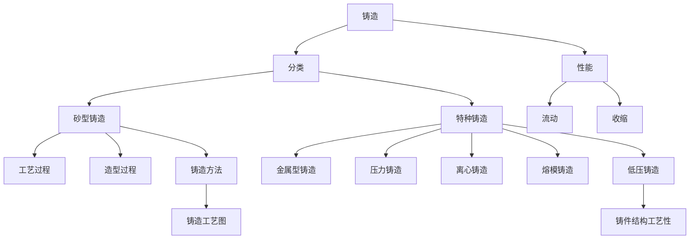

# 1. 引言 

# 2. 铸造凝固
## 2.1 基础理论 
1. [合金的铸造性能对铸件的影响](https://mp.weixin.qq.com/s/A-T9bKf7Fnsz9bIRo7e2Qg)
2. [一文了解金属的铸造方法](https://mp.weixin.qq.com/s/2KFWD_wYnE_xb-ZDb3lbSA)
3. [一文读懂金属的铸造缺陷](https://mp.weixin.qq.com/s/YanKkw7QqZ5BgFwCBrZIRA)
4. [各种金属成型工艺](https://mp.weixin.qq.com/s?__biz=MzA3MDM1MDkxNg==&mid=2666343135&idx=6&sn=447c360c3f3f9de7d8b3f60d571f3568&chksm=8427abf4b35022e290f9075ab4dce8e9c54f1ef92052e7647bd5f2472f6331065208c2ed1c82&scene=21#wechat_redirect)
5. [铸造的十种成型方法](https://mp.weixin.qq.com/s/_mnp-HsxgL3Tj6XKut11Jw)
6. [铸件产生热裂的原因](https://mp.weixin.qq.com/s/aYjZ0LF48_JejmZMCfr6vw)
7. [金属铸造基础知识](https://mp.weixin.qq.com/s/ADoE9qx9Dy2we6VmcnZo2g)
8. [铸件产生热裂的原因和防治措施](https://mp.weixin.qq.com/s/aYjZ0LF48_JejmZMCfr6vw)
9. [压铸件发黑及预防办法](https://mp.weixin.qq.com/s/YJAUdv__e_JOFKIh-iScVw)
10. [铝合金的压铸缺陷](https://mp.weixin.qq.com/s/oi8z4qy5oerH5rQ74TDtFw)
11. [一体化压铸铝合金的发展概述、应用案例及优缺点解析 ](https://mp.weixin.qq.com/s?__biz=MzI4MjM5MjEwMg==&mid=2247483782&idx=1&sn=3e143d9ad389943eefbf9b2a9f7a691a&scene=19#wechat_redirect)
12. [铝合金热冲压成型简介 ](https://mp.weixin.qq.com/s?__biz=MzI4MjM5MjEwMg==&mid=2247483795&idx=1&sn=6941435220e7331e7cd4b82b47c87e9d&scene=19#wechat_redirect)
13. [铝合金熔炼与浇注知识讲解！ (qq.com)](https://mp.weixin.qq.com/s/ZVK8i4O-vBW01uIk_r3uvA)
14. [高纯净度铸锭技术](https://mp.weixin.qq.com/s/jlZw2DEg82AivJbJOW_zdQ)
15. [电磁搅拌技术原理及应用](https://mp.weixin.qq.com/s/lRH43LULZOXqrk4WxNqkKQ)
16. [铝合金熔体除气净化技术](https://mp.weixin.qq.com/s/vngfJ849Kx8q9KaJCaPxnA)
17. [铝合金熔铸绿色高质低耗的关键技术与创新](https://mp.weixin.qq.com/s/qg61vYdI-6OwgUX6JjKy-A)
18. [【必读】如何在炼钢过程中控制非金属夹杂物](https://mp.weixin.qq.com/s/ReW5c21edxYuiC_k40k3lA)

## 2.2 铸造类别 

1. [压铸工艺知识积累PPT（全）](https://mp.weixin.qq.com/s/29wbNOvCEVlVynBd-c8aWg)

## 2.3 问题措施 
1. 压铸件发黑及预防办法[^1]
2. 铸件产生热裂的原因及预防措施[^2]

## 2.4 铸造工艺设计 

# Ref 

[^1]: [压铸件发黑原因及预防措施](https://mp.weixin.qq.com/s/YJAUdv__e_JOFKIh-iScVw)

[^2]: [【知识】铸件产生热裂的原因及措施](https://mp.weixin.qq.com/s/9wWQ9Rl4BoIQ4U5vOi8vZA)
