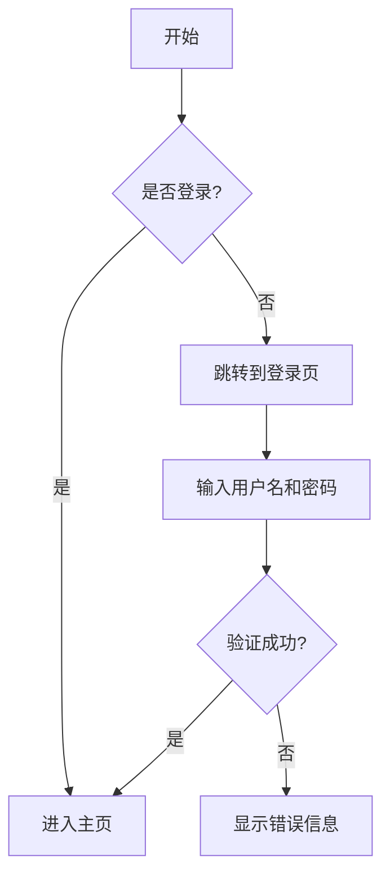
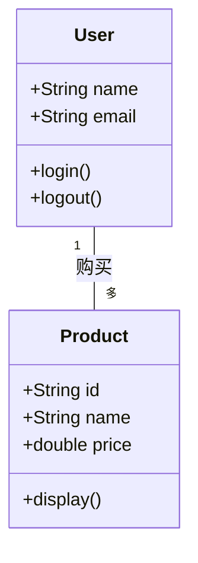
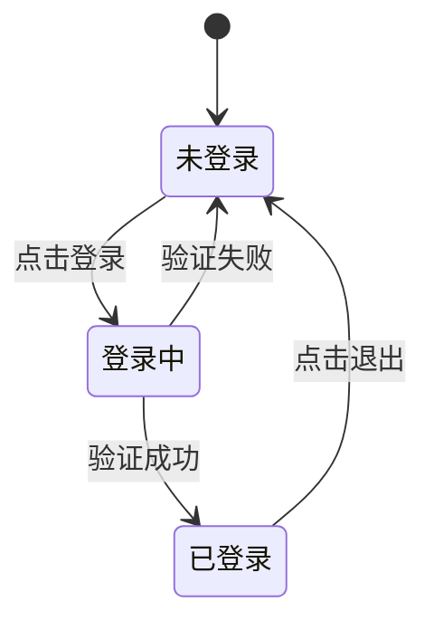
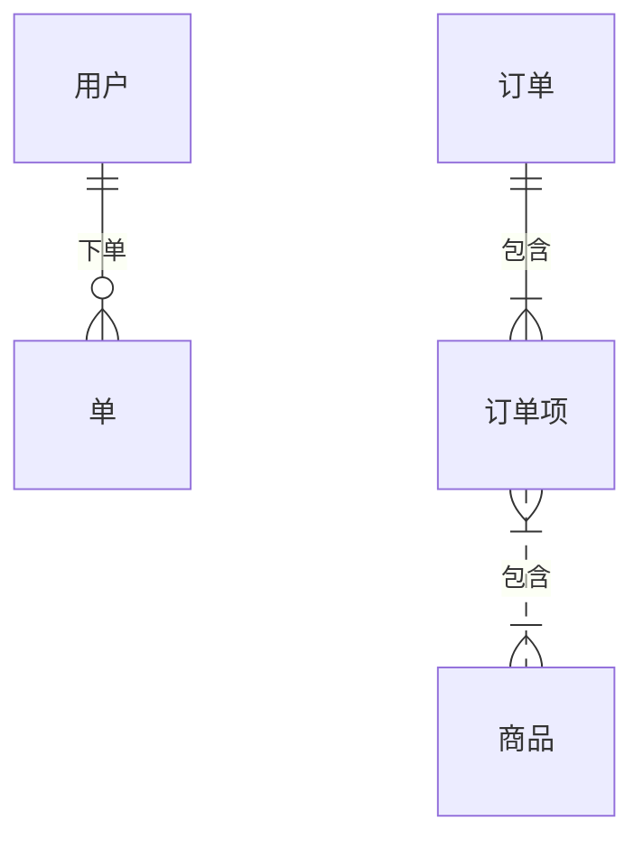
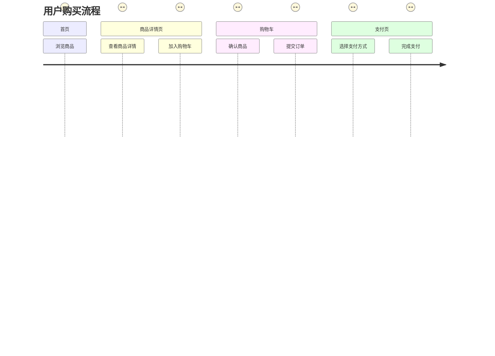
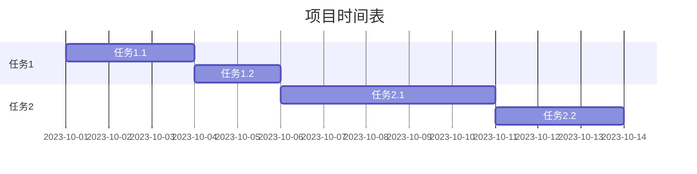
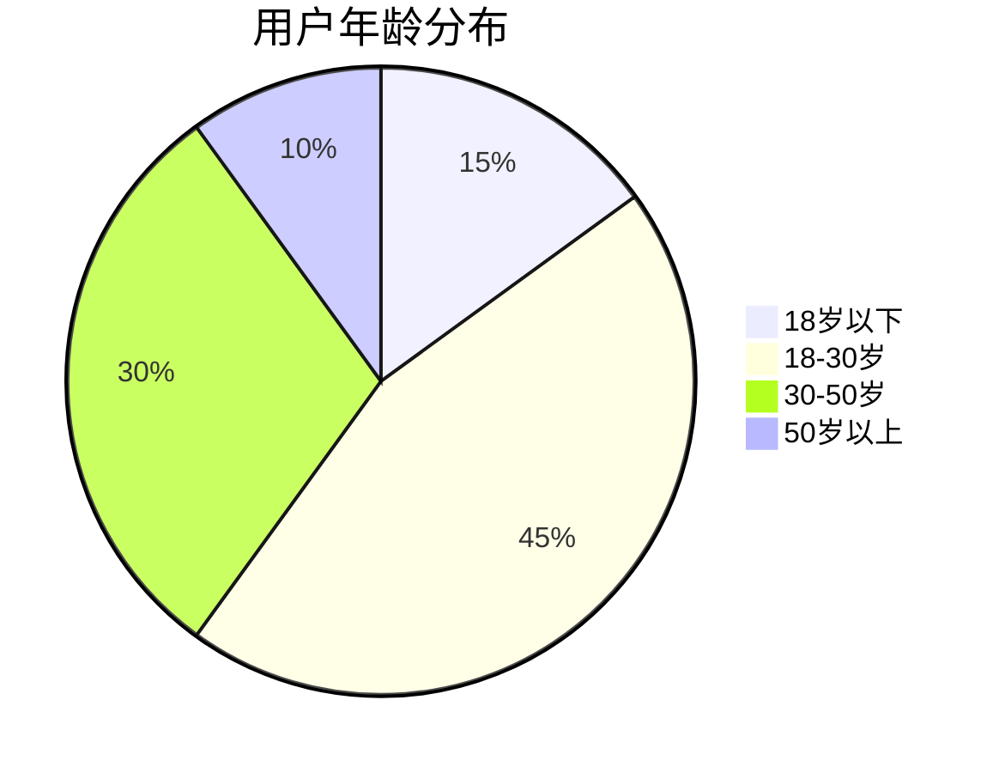

## Mermaid语法-流程图
```graph TD
    A[开始] --> B{是否登录?}
    B -- 是 --> C[进入主页]
    B -- 否 --> D[跳转到登录页]
    D --> E[输入用户名和密码]
    E --> F{验证成功?}
    F -- 是 --> C
    F -- 否 --> G[显示错误信息]
```


## Mermaid语法-时序图
```sequenceDiagram
    participant 用户
    participant 前端
    participant 后端
    用户->>前端：点击登录按钮
    前端->>后端：发送登录请求
    后端->>前端：返回登录结果
    前端->>用户：显示结果
```

```mermaid
sequenceDiagram
    participant 用户
    participant 前端
    participant 后端
    用户->>前端：点击登录按钮
    前端->>后端：发送登录请求
    后端->>前端：返回登录结果
    前端->>用户：显示结果
```
## Mermaid 语法-类图
```classDiagram
    class User {
        +String name
        +String email
        +login()
        +logout()
    }
    class Product {
        +String id
        +String name
        +double price
        +display()
    }
    User "1" -- "多" Product : 购买
```


## Mermaid 语法-状态
```stateDiagram-v2
    [*] --> 未登录
    未登录 --> 登录中 : 点击登录
    登录中 --> 已登录 : 验证成功
    登录中 --> 未登录 : 验证失败
    已登录 --> 未登录 : 点击退出
```


## Mermaid 语法-实体关系图
```erDiagram
    用户 ||--o{单  : 下单
    订单 ||--|{ 订单项 : 包含
    订单项 }|..|{ 商品 : 包含
```


## Mermaid 语法-用户旅程图
```journey
    title 用户购买流程
    section 首页
      浏览商品 : 30秒
    section 商品详情页
      查看商品详情 : 1分钟
      加入购物车 : 10秒
    section 购物车
      确认商品 : 30秒
      提交订单 : 20秒
    section 支付页
      选择支付方式 : 1分钟
      完成支付 : 30秒
```


## Mermaid 语法-甘特图
```gantt
    title 项目时间表
    dateFormat  YYYY-MM-DD
    section 任务1
    任务1.1 :a1, 2023-1-001, 3d
    任务1.2 :a2, 2023-10-04, 2d
    section 任务2
    任务2.1 :a3, 2023-10-06, 5d
    任务2.2 :a4, 2023-10-11, 3d
```


## Mermaid 语法-饼图
```pie
    title 用户年龄分布
    "18岁以下" : 15
    "18-30岁" : 45
    "30-50岁" : 30
    "50岁以上" : 10
```



## Mermaid 语法-需求图
```requirementDiagram
    requirement "需求1" {
        id: R1
        text: "用户可以登录系统"
    }
    requirement "需求2" {
        id: R2
        text: "用户可以查看商品列表"
    }
    requirement "需求3" {
        id: R3
        text: "用户可以下单购买商品"
    }
    R1 --> R2
    R2 --> R3
```

```mermaid
requirementDiagram
    requirement "需求1" {
        id: R1
        text: "用户可以登录系统"
    }
    requirement "需求2" {
        id: R2
        text: "用户可以查看商品列表"
    }
    requirement "需求3" {
        id: R3
        text: "用户可以下单购买商品"
    }
    R1 --> R2
    R2 --> R3
```
## Mermaid 语法-Git
```maidgitGraph
    commit
    branch develop
    checkout develop
    commit
    commit
    branch feature
    checkout feature
    commit
    commit
    checkout main
    merge feature
```

```mermaid
maidgitGraph
    commit
    branch develop
    checkout develop
    commit
    commit
    branch feature
    checkout feature
    commit
    commit
    checkout main
    merge feature
```
## Mermaid 语法-一些示例
