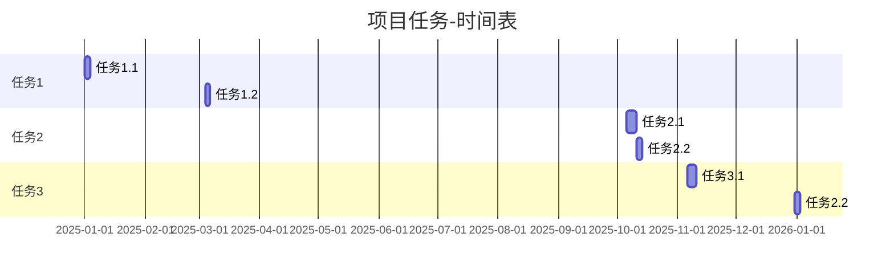
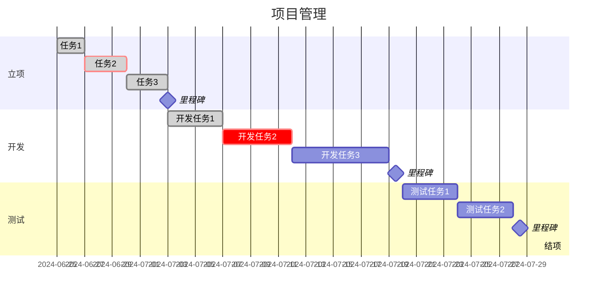

```mermaid
gantt
    title 项目任务-时间表
    dateFormat  YYYY-MM-DD
    section 任务1
    任务1.1 :a1, 2025-01-01, 3d
    任务1.2 :a2, 2025-03-04, 2d
    section 任务2
    任务2.1 :a3, 2025-10-06, 5d
    任务2.2 :a4, 2025-10-11, 3d
    section 任务3
  	任务3.1 :a4, 2025-11-06, 5d
  	任务2.2 :a5, 2025-12-31, 3d
```

```mermaid
gantt
    title 项目管理
    dateFormat YYYY-MM-DD
    axisFormat %Y-%m-%d
    tickInterval 7d
section 立项
    任务1:done,2024-06-25,2d
    任务2:crit,done,3d
    任务3:done,3d
    里程碑:milestone,2024-07-03,0d
section 开发
    开发任务1:done,2024-07-03,4d
    开发任务2:crit,5d
    开发任务3:7d
    里程碑:milestone,1d
section 测试
    测试任务1:4d
    测试任务2:4d
    里程碑:milestone,1d
    结项:active,2024-07-30,2024-07-31:1d
```
